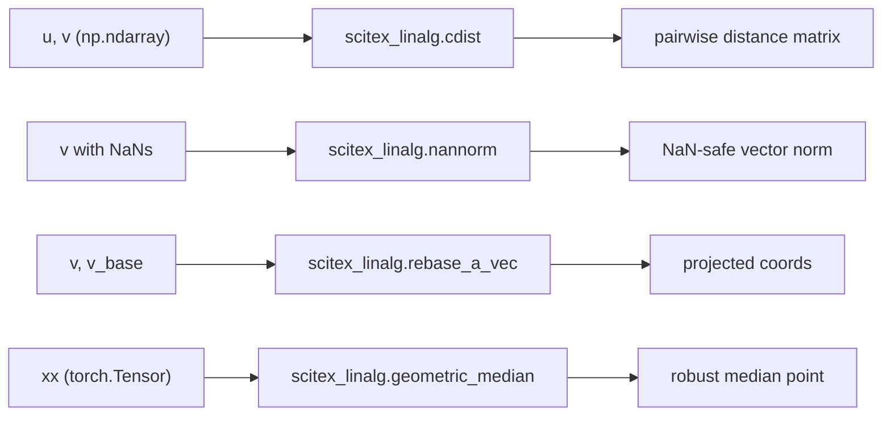

# scitex-linalg

<p align="center">
  <a href="https://scitex.ai">
    
  </a>
</p>

<p align="center"><b>Small linear-algebra helpers — distances, NaN-aware norms, geometric median, vector projections.</b></p>

<p align="center">
  <a href="https://scitex-linalg.readthedocs.io/">Full Documentation</a> · <code>pip install scitex-linalg</code>
</p>

<!-- scitex-badges:start -->
<p align="center">
  <a href="https://pypi.org/project/scitex-linalg/"></a>
  <a href="https://pypi.org/project/scitex-linalg/"></a>
  <a href="https://github.com/ywatanabe1989/scitex-linalg/actions/workflows/test.yml"></a>
  <a href="https://github.com/ywatanabe1989/scitex-linalg/actions/workflows/install-test.yml"></a>
  <a href="https://codecov.io/gh/ywatanabe1989/scitex-linalg"></a>
  <a href="https://scitex-linalg.readthedocs.io/en/latest/"></a>
  <a href="https://www.gnu.org/licenses/agpl-3.0"></a>
</p>
<!-- scitex-badges:end -->

---

## Installation

```bash
pip install scitex-linalg            # core (numpy/scipy/sympy)
pip install "scitex-linalg[torch]"   # + geometric_median (torch + geom-median)
```

## Architecture

```
scitex_linalg/
├── _distance.py             ← euclidean_distance, cdist, edist, cosine
├── _misc.py                 ← nannorm, rebase_a_vec, three_line_lengths_to_coords
├── _geometric_median.py     ← torch geometric median (optional [torch] extra)
├── _vendor_decorators/      ← vendored numpy_fn / torch_fn / wrap (no scitex.* runtime dep)
└── _skills/                 ← agent-facing skill pages
```

Tiny single-purpose helpers. Pure numpy/scipy core; the geometric-median
path opts into `torch` only when the `[torch]` extra is installed.

## 1 Interfaces

<details open>
<summary><strong>Python API</strong></summary>

<br>

```python
import scitex_linalg as sxl

sxl.euclidean_distance(u, v, axis=0)      # element-wise Euclidean distance
sxl.cdist(u, v)                           # pairwise distances
sxl.edist(u, v)                           # alias for cdist
sxl.cosine(v1, v2)                        # cosine similarity (NaN-safe)
sxl.nannorm(v, axis=-1)                   # NaN-aware vector norm
sxl.rebase_a_vec(v, v_base)               # project v onto v_base basis
sxl.three_line_lengths_to_coords(a, b, c) # triangle side lengths -> 2-D coords
sxl.geometric_median(xx, dim=-1)          # torch geometric median (requires [torch] extra)
```

</details>

## Demo



```python
>>> import numpy as np, scitex_linalg as sxl
>>> sxl.cosine(np.array([1, 0]), np.array([1, 1]))
0.7071...
>>> sxl.nannorm(np.array([3.0, np.nan, 4.0]))
5.0
```

## Quick Start

```python
import scitex_linalg as sxl

sxl.cdist(u, v)                # pairwise distances
sxl.cosine(v1, v2)             # cosine similarity (NaN-safe)
sxl.nannorm(v, axis=-1)        # NaN-aware norm
sxl.rebase_a_vec(v, v_base)    # project v onto v_base basis
```

## Status

Standalone fork of `scitex.linalg` — intended to remain importable as
`scitex.linalg` via the SciTeX umbrella package's bridge module. Decorators
(`numpy_fn`, `torch_fn`, `wrap`) are vendored under `_vendor_decorators/`
to keep the package free of `scitex.*` runtime deps; when `scitex-decorators`
is split out, those will be replaced with a direct dependency.

## Part of SciTeX

`scitex-linalg` is part of [**SciTeX**](https://scitex.ai). Install via
the umbrella with `pip install scitex[linalg]` to use as
`scitex.linalg` (Python).

>Four Freedoms for Research
>
>0. The freedom to **run** your research anywhere — your machine, your terms.
>1. The freedom to **study** how every step works — from raw data to final manuscript.
>2. The freedom to **redistribute** your workflows, not just your papers.
>3. The freedom to **modify** any module and share improvements with the community.
>
>AGPL-3.0 — because we believe research infrastructure deserves the same freedoms as the software it runs on.

## License

AGPL-3.0-only (see [LICENSE](./LICENSE)).

---

<p align="center">
  <a href="https://scitex.ai" target="_blank"></a>
</p>
